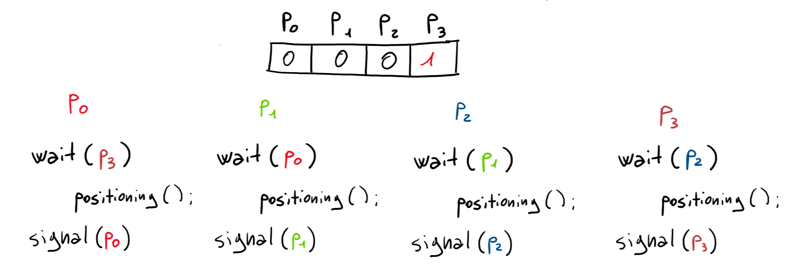

# OS-Project 2019/2020
## Index
1. IPC's used, sinchronization of the game and related Scheme
2. Positioning of the Pawns
3. Player strategy-alghoritm for the Pawns
4. Movement strategy of the Pawns

# IPC's Used

## Semaphores
The Sinchronization of the entire Game is regulated with a series of Semaphores and Message Queues. The Semaphores used are:
1.  **Master Semaphores**
    * **Main Semaphore**
    This is used globally in all the three executable and it's the core of the entire Synchronization.
    It is composed by 5 entry.
    * **Chessboard Semaphore**
    This is the semaphore used to manage the positioning and the movement of the pawns.
    * **Turn Semaphore**
    Used to implement the mutual exclusion positioning for the player.
    Every entry represents a Player.
2. **Players Semaphores**
    An array of 4 semaphores used to garantuee the synchronization between Player and Pawns, usually in Wait-for-0 mode.

## Message Queues
1. **Master-Players queue**
    * Used to send the Taken-Flag messages and the Used Moves from the Players to the Master
2. **Player-Pawns**
    1. Used by the player to send the Positions and the Goal-Flag dispositions to the Pawns
    2. Used by the Pawns to send the Taken-Flag Messages to the Player, in order to not receive the       sent message while reading the Strategy Messages.

## Shared Memories
1. **Chessboard**
    The *chessboard* is realized with an array allocated in Shared Memory.
    The size of this portion of memory is the multiplication of the columns number and the rows number.

    > To treat it *like a matrix*, the solution is to applicate *row * columns_number + column* formula everytime is necessary to access the chessboard.

2. **Parameters**
    The parameters, read by the Master from the *config.txt* file, are stored in Shared Memory, in order to make them accessible to the Players and the Pawns.
3. **Positions**
    Used to store the calculated positions and make them accessible by the Players, in order to complete the positioning phase.

## Synchronization
The Synchronization is made up by different steps:
1. The Master initializes the SYNCHRO entry with 0 and the MASTER entry with the number of players.
   He also initialize the size-1 entry of the Turn Semaphore with 1, to make accessible the positioning for the first player. 
   After that, he forks the Players and wait for 0 on MASTER the check from the last ones.
2. The players set the first entry of the Players Semaphore with the number of pawns and try to access the positioning critical section. To do that, he tries to reserve the semaphore of the player before him and, if he did it, release his entry.
The mechanism is schematized in the image below:
 

In the critical section, a player peek a valid position in the chessboard by taking it in the Positions Shared Memory, every time it's his turn, and send that with the first Message Queue to the Pawns.
Then, he forks the pawns, and wait for 0 on the semaphore he set.

3. The Pawns read the message related to their type and set their positions, unlock the players by reserving the player set semaphore and wait in read for the strategy message.

4. The unlocked players unlock the master and wait on the preset SYNCHRO entry of the Main Semaphore

5. The master calculates the number of flags, their score and place them in the chessboard.
Then he set the A entry and the SYNCHRO entry of the Main Semaphore to the number of players and wait for 0 on the first one.

6. The player set again the first entry of the Player Semaphore, calculate the associations flag(s)-pawn and send the strategy to the pawns.
The he wait for 0 on the set semaphore.

7. The pawns unblocks theirselves by reading the message, handle the received strategy by creating an array to store all the informations, unlock the players and wait on the START entry of the Main Semaphore.

8. The players unlock the Master by reserving on A entry.

9. The game starts with the Master that unlock the players by setting the MASTER entry to the number of Players and the players unlock the Pawns by setting the START entry to yhe number of them.

